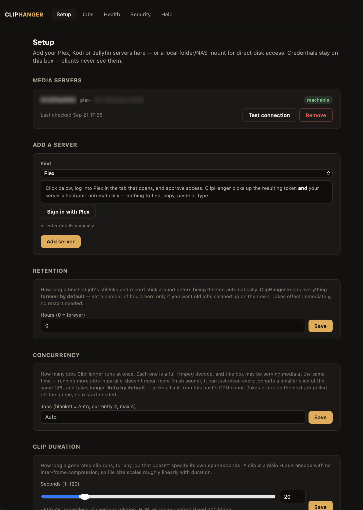
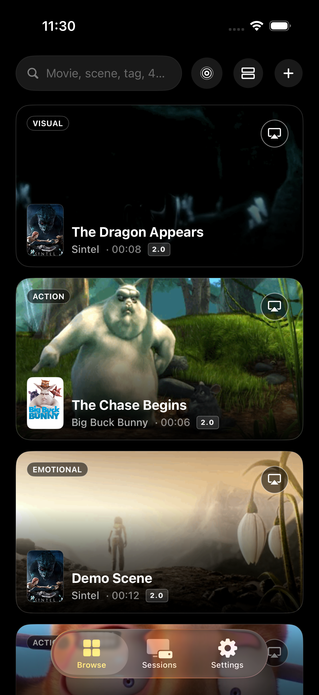
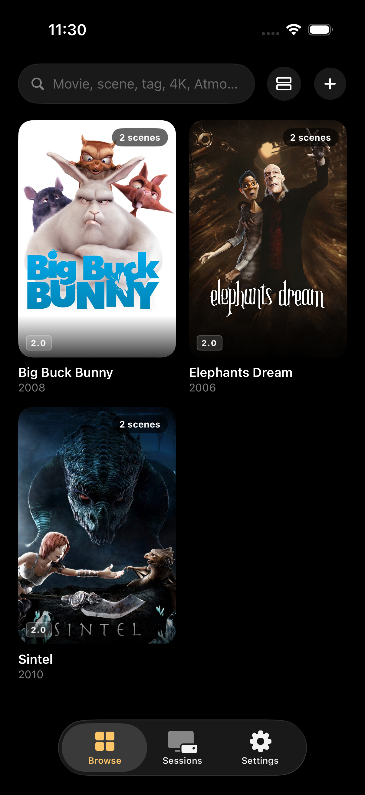
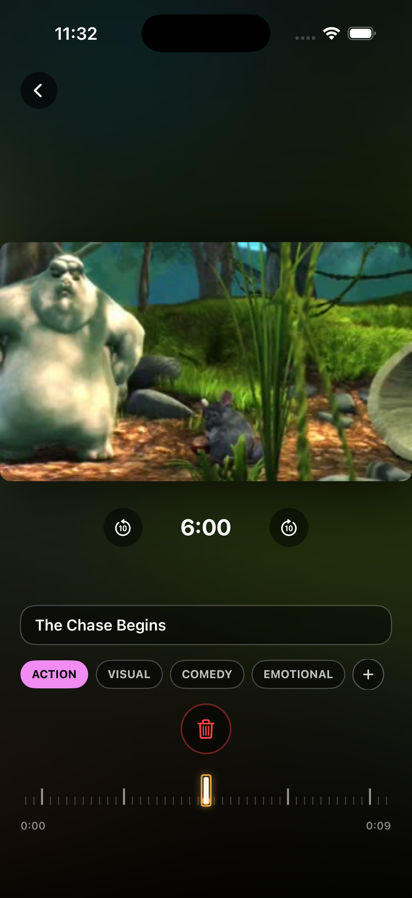

# ClipHanger

Extract stills and short clips from your media library at a given
timestamp.

Point it at Plex, Kodi or Jellyfin, ask for "item X at 1:35:00", and get
back a still and a 20-second clip — plus what the file actually is (4K,
HDR10, Atmos, DTS:X). Self-hosted, single container, no cloud, no
accounts beyond your own media servers.

**[DemoFlex](#clients)** — an iOS app that browses demo-worthy movie
scenes and one-tap plays them on your home theatre — is the first real
client built on this, and the reason it exists.

> **Status: early, working.** Core pipeline (server config, resolve,
> extract, queue, web UI, Sign in with Plex) runs end-to-end and has
> been tested against a real Plex library on a real NAS. Kodi and
> Jellyfin backends are implemented but not yet verified against real
> servers. No release builds or container images are published yet —
> build from source (below).

<p align="center">
  
</p>

## Contents

- [Why](#why)
- [How it works](#how-it-works)
- [Features](#features)
- [Installation](#installation)
  - [Before you start](#before-you-start)
  - [Option 1: Docker Compose (recommended)](#option-1-docker-compose-recommended)
    - [Linux (Docker Engine, a home server, a mini PC, etc.)](#linux-docker-engine-a-home-server-a-mini-pc-etc)
    - [Windows or macOS (Docker Desktop)](#windows-or-macos-docker-desktop)
  - [Option 2: Plain `docker run` (no compose file)](#option-2-plain-docker-run-no-compose-file)
  - [Option 3: Synology NAS](#option-3-synology-nas)
  - [Option 4: Unraid](#option-4-unraid)
  - [Option 5: Build and run without Docker at all](#option-5-build-and-run-without-docker-at-all)
    - [Why isn't ffmpeg bundled?](#why-isnt-ffmpeg-bundled)
- [First-time setup](#first-time-setup)
  - [Optional: direct disk access (skip Plex/Kodi/Jellyfin's own serving)](#optional-direct-disk-access-skip-plexkodijellyfins-own-serving)
  - [Environment variables](#environment-variables)
- [API](#api)
- [Documentation](#documentation)
- [Clients](#clients)
- [Status / roadmap](#status--roadmap)
- [Contributing](#contributing)
- [Licence](#licence)
- [Security](#security)

## Why

Plenty of clients want a frame from a specific moment and can't get one.
iOS is the motivating case: its media stack has no Matroska support, so
`.mkv` — most of a real media library — simply won't decode on-device,
and `AVAssetImageGenerator` doesn't work against a transcoded HLS stream
either. Browsers and embedded clients hit their own versions of the same
wall. ffmpeg on an always-on box has none of these problems.

ClipHanger does the work once, keeps the result, and hands it to
whichever client asked — without that client ever touching a media
server's credentials, a NAS mount, or a path translation.

## How it works

1. Configure your media servers in the web UI — "Sign in with Plex"
   discovers your Plex servers automatically (no host/port/token to type
   in by hand); Kodi and Jellyfin take a host and credentials directly.
   Credentials never leave the box.
2. A client submits a batch of captures (`POST /jobs`) and walks away.
3. ClipHanger asks the server where each file actually lives, streams
   it over HTTP, and runs ffmpeg — still + clip + an ffprobe pass, in
   one job.
4. The client polls (`GET /jobs`), then fetches the still/clip it wants.

It never reads media off disk directly — no NAS mounts, no path
translation, and it works regardless of which machine it runs on
relative to where the media actually lives.

## Features

- **Plex, Kodi, Jellyfin** — one job model across all three; each
  backend resolves its own server's item id to a real streamable URL.
- **Local Folder / NAS Mount** — an optional, explicitly-configured
  server kind that reads a file straight off a disk ClipHanger already
  has access to, instead of streaming it from Plex/Kodi/Jellyfin over
  HTTP — no server session, auth, or transcode step to go wrong. A
  client chooses when to resolve an item this way, e.g. as a fallback
  once a normal server attempt fails. See "Optional: direct disk
  access" below.
- **Sign in with Plex** — the standard plex.tv PIN/link flow, followed
  by automatic server discovery (`GET /api/v2/resources`), preferring a
  server's LOCAL network address over a remote/relay one. No manual
  host/port/token entry needed for Plex.
- **Still + clip in one pass** — a JPEG at the exact timestamp, and an
  MP4 (H.264) clip spanning it (`spanSeconds`/`fps` are the only two
  adjustable knobs — see `docs/DECISIONS.md` "Output is fixed, not
  negotiated").
- **Real media metadata, not a guess** — an ffprobe pass alongside every
  job reports resolution, HDR10/HLG/Dolby Vision (with profile), and
  audio codec/channels/Atmos/DTS:X, so a client can show accurate format
  badges instead of inferring them from a filename.
- **Idempotent job submission** — resubmitting a `captureId` that's
  already `done` is skipped, not redone, unless `force` is set.
- **Live ffmpeg output on the Jobs page** — watch a running job's actual
  ffmpeg stderr while it's in flight, not just a spinner.
- **Configurable retention** — keeps generated media forever by default;
  set a retention window (in hours) from the Setup page at any time,
  takes effect immediately, no restart. A background sweep reaps
  expired jobs and their files.
- **Configurable default clip duration** — 20 seconds out of the box,
  adjustable from the Setup page with a live estimated-file-size hint,
  for any job that doesn't specify its own `spanSeconds`.
- **Auto-sized concurrency, live-adjustable, plus a timeout** — max
  concurrent jobs defaults to **Auto** (picked from this host's CPU
  count) and is changeable anytime from the Setup page, no restart
  needed — each running job is a full ffmpeg decode, so this really is
  a concurrency limit, not just a thread-pool size, and more of them
  doesn't mean more finish sooner past what the host can actually decode
  in parallel. `JOB_TIMEOUT_SECONDS` bounds how long one job may run
  before it's killed and marked failed (a slow remote seek over MKV can
  genuinely take minutes).
- **Open web UI, API-key-gated API** — the Setup/Jobs/Health/Security
  pages have no login by default, on the assumption this is running on
  a trusted home LAN; every `X-Api-Key`-gated endpoint is what an actual
  client (like DemoFlex) authenticates against, unaffected either way. A
  real username/password for the web UI itself is available too — opt in
  from the **Security** page if you want this box to ask for a login
  even on your own network. See `docs/DECISIONS.md`.
- **Credential-free `/servers`** — a client can list configured servers
  and pick one without ever seeing a Plex token or Kodi password.
- **Deploy script for a Synology NAS** — `deploy-to-synology-nas.sh`
  ships source over SSH (not rsync — see its own comments for why) and
  runs `docker compose up -d --build` remotely, for a box with
  Docker/Container Manager but no local build tooling.

## Installation

There's no published container image yet (see Status below), so **every
install path here builds the image from source** — that just means
Docker does the compiling for you as part of `docker compose up
--build`; you don't need Go installed, or to compile anything by hand,
unless you pick the "no Docker at all" option at the bottom. Once an
image is published, the GUI-only paths (Synology's Registry search,
Unraid's Community Applications) become possible too — not yet.

### Before you start

- **Docker.** If you already run Plex/Jellyfin/Sonarr/Radarr etc. in
  containers, you have this. If not: Synology and Unraid both ship it
  as an app you install from their own app store (Container Manager on
  Synology's DSM, the Docker tab on Unraid — already installed on most
  Unraid setups). On a regular Mac/Windows/Linux machine, install
  [Docker Desktop](https://www.docker.com/products/docker-desktop/) (Mac/Windows) or
  Docker Engine (Linux, via your distro's package manager or
  `curl -fsSL https://get.docker.com | sh`). Check whether you already
  have it with `docker --version` in a terminal.
- **Port 8420 free** on whichever machine will run it (or pick a
  different host port when you map it — see below).
- **Network reachability, both directions**: the machine running
  ClipHanger needs to reach your Plex/Kodi/Jellyfin server(s) directly
  over your LAN, AND whatever client will call its API (DemoFlex, a
  browser, `curl`) needs to reach IT — on Windows/macOS specifically,
  this second direction needs a real published port, not the default
  compose file as-is; see the Windows/macOS section under Option 1
  below before you conclude "it's up but nothing can reach it."

### Option 1: Docker Compose (recommended)

This is the easiest path if you're at all comfortable in a terminal.
"Cloning the repo" just means downloading the source code with `git`
(pre-installed on macOS/Linux; on Windows, [install Git](https://git-scm.com/downloads)
or just download the ZIP from GitHub's own "Code" button instead of
using the `git clone` line below).

```bash
git clone https://github.com/sreenathkc/cliphanger.git
cd cliphanger
```

Before running `docker compose up`, pick the networking mode for your
OS — this is the one setting that genuinely differs by platform, and
getting it wrong is the single most common "it built and started, but
nothing can reach it" problem (a real one: see the Windows section
below).

#### Linux (Docker Engine, a home server, a mini PC, etc.)

No edit needed — the shipped `docker-compose.yml` already uses host
networking (`network_mode: host`), which is both simpler AND the
correct choice here: under a bridge network, ClipHanger's outbound
requests to a media server on the same LAN would carry a Docker-internal
source IP, which Plex doesn't recognize as local and fast-rejects with
a 500. Host networking makes ClipHanger indistinguishable from any
other process on the box — nothing else to configure.

```bash
docker compose up -d --build
```

(Running this on a Synology NAS or Unraid specifically? Their own
sections below cover a couple of platform quirks worth knowing —
otherwise this is the same command.)

#### Windows or macOS (Docker Desktop)

**Docker Desktop doesn't support host networking the same way Linux
does.** Leaving `network_mode: host` as-is here means the container is
reachable from `localhost` on the SAME machine only — never from your
phone, a tablet, or another computer on the LAN — which is almost never
what you actually want for a service other devices need to reach (this
is exactly the failure mode behind "I can open it on this PC but not
from my phone").

Open `docker-compose.yml` in a text editor and swap which lines are
commented out, so it reads:

```yaml
    # network_mode: host
    ports:
      - "8420:8420"
```

Then:

```bash
docker compose up -d --build
```

**Windows Firewall**: the first time a container publishes a port,
Windows normally prompts to allow it through — click **Allow**. If you
missed that prompt (or another device still can't reach it), check
**Windows Defender Firewall → Allow an app through firewall** and make
sure **Docker Desktop Backend** is checked for both Private and Public
networks.

**Verify it's reachable from the actual LAN, not just from this
machine** — Docker Desktop can make `http://localhost:8420` work even
when nothing outside the box can reach it, so that alone doesn't prove
the port mapping is right. From a DIFFERENT device on the same network
(your phone's browser, another computer's terminal):

```bash
curl http://<this machine's LAN IP>:8420/health
```

`{"status":"ok"}` means it's genuinely reachable — go to **First-time
setup** below. A timeout or connection failure means the port isn't
actually published to the LAN yet: recheck the compose edit above and
the firewall step, and confirm you're using this machine's real LAN IP
(`ipconfig` on Windows, `ifconfig`/`ip addr` on macOS/Linux — not
`127.0.0.1` or `localhost`).

Once it's up, skip to **First-time setup** below.

### Option 2: Plain `docker run` (no compose file)

Same result as Option 1, as one command, if you'd rather not use
Compose at all. Run this from inside the cloned `cliphanger` folder:

```bash
docker build -t cliphanger .
docker run -d --name cliphanger \
  --network host \
  -v "$(pwd)/data:/data" \
  --restart unless-stopped \
  cliphanger
```

`docker build` compiles the image and tags it `cliphanger` so the next
command can find it. `-d` runs it in the background; `--network host`
is the same host-networking Compose uses (**Linux only** — on
macOS/Windows replace it with `-p 8420:8420` instead, and see Option
1's Windows/macOS section above for the firewall step and how to check
it's actually reachable from the LAN, not just this machine);
`-v "$(pwd)/data:/data"` is where the job queue and generated media are
stored, on your machine, so they survive a container restart;
`--restart unless-stopped` brings it back up automatically after a
reboot.

### Option 3: Synology NAS

1. **Enable SSH** (one-time): DSM → Control Panel → Terminal & SNMP →
   check "Enable SSH service."
2. **Enable Docker/Container Manager** if you haven't already: Package
   Center → search "Container Manager" → Install.
3. From another computer on the same network, open a terminal and
   connect: `ssh your-dsm-username@your-nas-ip`. (On Windows, use the
   Terminal app, or PuTTY if you're on an older Windows version.)
4. From there, follow **Option 1** above, run directly on the NAS over
   this SSH session — `git` may not be installed on your NAS; if
   `git clone` fails, download the repo as a ZIP from GitHub on your
   regular computer instead and upload it to the NAS with DSM's File
   Station, then `cd` into it over SSH and run `docker compose up -d
   --build`.

If you'd rather build the image on your own Mac/PC and just push the
result to the NAS over SSH instead of doing all of the above by hand
every time, this repo's `deploy-to-synology-nas.sh` automates exactly
that — see its own header comment for the one-time SSH key and
passwordless-`sudo` setup it expects (Synology's Docker package doesn't
create a `docker` group the way a typical Linux install does, so a
plain SSH user can't run `docker` commands without that one-time step).
Once set up:

```bash
export CLIPHANGER_NAS_REMOTE=you@192.168.1.50
export CLIPHANGER_NAS_PATH=/volume1/docker/cliphanger   # optional, this is the default
./deploy-to-synology-nas.sh
```

**Performance note:** Synology's own CPUs (ARM or the smaller Celeron/
Ryzen embedded chips most models ship with) are modest, and ClipHanger's
ffmpeg encode is 100% software — no NVENC/QuickSync/VAAPI, no use of
Synology's own hardware transcode chip either (see Status below). In
practice, on this class of hardware, one job at a time genuinely
performs best — running several extractions in parallel just makes each
one slower rather than finishing more of them sooner, since they're all
competing for the same few real cores. The **Auto** concurrency default
(see Features above) picks something higher than 1 on most Synology
boxes, since it only looks at core count, not how weak those cores
actually are. If jobs feel slower than expected on a Synology NAS,
override it to **1** from the Setup page's Concurrency section (or set
`WORKERS=1` before first run) rather than trusting Auto here.

### Option 4: Unraid

There's no Community Applications template yet (that needs a published
image — see Status below). For now: open Unraid's own **Terminal** (top
right of the web UI) and follow **Option 1** or **Option 2** above
directly — Unraid ships Docker already, so nothing extra to install.
Point the `-v` volume (or `docker-compose.yml`'s `volumes:` line) at a
path under your array, e.g. `/mnt/user/appdata/cliphanger/data`, so it
survives an Unraid reboot the same way any other app's appdata does.

### Option 5: Build and run without Docker at all

For running it as a plain background process instead of a container —
you'll need [Go](https://go.dev/dl/) 1.23+ and **ffmpeg** installed and
on your `PATH` yourself (a container normally provides this for you;
see "Why isn't ffmpeg bundled?" below). Installing ffmpeg: `brew install
ffmpeg` (macOS), `apt install ffmpeg` (Debian/Ubuntu), or your distro's
package manager — anything reasonably recent works.

```bash
git clone https://github.com/sreenathkc/cliphanger.git
cd cliphanger
make build   # go build -o bin/cliphanger ./cmd/cliphanger
make run     # DATA_DIR=./data ./bin/cliphanger
```

#### Why isn't ffmpeg bundled?

ClipHanger shells out to a separately-installed ffmpeg rather than
compiling it in, because redistributing a compiled ffmpeg carries
GPL/LGPL obligations that vary by exactly how it was built — see
`docs/DECISIONS.md`. The Docker image already includes it (installed
from Debian's own package repository at build time), so this only
matters if you're running the bare binary yourself.

## First-time setup

However you installed it, the steps from here are the same:

1. Open `http://<the machine's address>:8420` in a browser — e.g.
   `http://192.168.1.50:8420` if that's the NAS/server's LAN IP, or
   `http://localhost:8420` if it's running on the same computer you're
   browsing from.
2. You'll land on the **Setup** page directly — no login, no account to
   create (see `docs/DECISIONS.md` for why the web UI is open by
   default on your LAN). If you'd rather this box ask for a real login
   even on your own network, turn that on from the **Security** page —
   off unless you opt in.
3. **Add a media server.** For Plex, click "Sign in with Plex" — it
   opens plex.tv's own sign-in page and then lists your Plex servers to
   pick from, no host/port/token to type in by hand. For Kodi or
   Jellyfin, fill in the host, port, and credentials directly, and use
   "Test connection" before saving.
4. **Find your API key** on the **Security** page (under "API key") —
   this is what a client application (like DemoFlex) needs to actually
   talk to ClipHanger. It's also printed in the container's logs on
   first start: `docker logs cliphanger | grep "API key ready"`.

That's it — ClipHanger is ready to accept jobs. See `docs/API.md` for
what a client actually sends.

### Optional: direct disk access (skip Plex/Kodi/Jellyfin's own serving)

Rather than streaming a file over HTTP from its own media server,
ClipHanger can read it straight off disk instead — useful as a faster,
more reliable path when a server's own serving is flaky for a specific
item (see `docs/DECISIONS.md`). This needs three things: the container
needs to actually SEE your media (a volume mount — different steps
depending on your platform, below), `docker-compose.yml` needs to know
about that mount, and the Setup page needs a server configured to use
it. This repo's `docker-compose.yml` doesn't include the mount by
default, since not every install wants this.

**1. Give the container access to your media.** Docker only ever sees
what you explicitly share with it — this is true regardless of platform
and can't be skipped by any UI. How you get there differs:

- **Linux (Docker Engine, a home server, a NAS itself)** — the simplest
  case: the host can mount an NFS/SMB share directly, and `docker-compose.yml`
  bind-mounts that host path straight into the container, no
  intermediate step. If your NAS shares are already mounted on this
  host for other purposes (Sonarr/Radarr etc. usually need this too),
  reuse the same mount point.
- **Windows (Docker Desktop)** — two options, try the first one first:

  **Option A — mapped network drive.** File Explorer → **This PC** →
  **Map network drive** → `\\<nas-ip>\<share-name>` → pick a drive
  letter (e.g. `Z:`). Then Docker Desktop → **Settings → Resources →
  File sharing** → make sure that drive is allowed. Reference it in
  `docker-compose.yml` as `Z:\:/mnt/nas` (step 2 below), then check with
  step 3's `docker exec ... ls` — if you see your real files, you're
  done. If it's empty or errors, that's a real, known limitation: a
  *mapped* network drive is a Windows-Explorer-session construct, and
  Docker Desktop's WSL2 backend doesn't always bind-mount it cleanly.
  Move to Option B.

  **Option B — mount it inside WSL2 directly (more reliable for a
  network share).** Docker Desktop's WSL2 backend is a real Linux
  environment underneath, which CAN mount an SMB share natively — this
  sidesteps the drive-letter translation Option A relies on entirely.

  ```
  wsl                                              # from PowerShell
  sudo mkdir -p /mnt/nas-share
  sudo mount -t cifs //<nas-ip>/<share-name> /mnt/nas-share \
    -o username=<nas-username>,password=<nas-password>,vers=3.0
  ```

  Then point `docker-compose.yml`'s volume at `/mnt/nas-share` (a
  regular Linux path now, not a drive letter) instead of `Z:\`. One
  catch: this mount doesn't survive a Windows/WSL restart on its own —
  either re-run it after a reboot, or add it to that WSL distro's own
  `/etc/fstab` if you want it permanent.
- **macOS (Docker Desktop)** — Finder → **Go → Connect to Server**
  (`smb://<nas-ip>/<share-name>` or `nfs://<nas-ip>/<path>`), which
  mounts it under `/Volumes/<share-name>`. Docker Desktop's **Settings →
  Resources → File sharing** needs that path (or its parent, `/Volumes`)
  allowed.

**2. Add the mount to `docker-compose.yml`.** One line under the
existing `data` volume:

```yaml
    volumes:
      - ./data:/data
      - /volume1/Movies:/mnt/nas/Movies   # host path : container path
```

The host side is whatever step 1 gave you — a Linux mount point, a
Windows drive letter (`Z:\`), or a macOS `/Volumes/...` path. The
container side is yours to pick; `/mnt/nas/Movies` is just a
convention. Apply it:

```
docker compose up -d
```

No `--build` needed — this only changes what's mounted, not the image.

**3. Verify the container can actually see it** before touching the
Setup page — this is the step that catches a mount that silently didn't
attach:

```
docker exec <container name> ls /mnt/nas/Movies
```

(`docker ps` if you don't know the exact container name.) You should
see your real folders/files. Empty output or an error means the mount
in step 1 or the compose line in step 2 needs another look before
anything past this point will work.

**4. Add a "Local Folder / NAS Mount" server** on the Setup page — pick
that as the Kind, give it a name, and fill in ClipHanger's own path (the
container path from step 2 — a **Browse…** button next to that field
lets you click through this container's real folders instead of typing
it, so you can confirm step 1–3 actually worked while you're at it).
The other field — the path exactly as your *real* media server
(Plex/Kodi/Jellyfin) reports it for a file — is optional at this point:
**it has to match exactly** when you do fill it in (a plain text prefix
comparison, not resolved or guessed), so if you don't already know it,
leave it blank, save the server anyway, and try generating a preview
through it once. That attempt will fail, but this server's own card on
the Setup page will then show the exact path it was given, with a
**Use this as the prefix** button to adopt it — no need to dig through
the Jobs page by hand.

A client (DemoFlex) chooses when to actually try this server for a
given item — adding it here doesn't change how anything already
configured behaves.

### Environment variables

| Variable | Default | What it does |
|---|---|---|
| `DATA_DIR` | `/data` | Where the store file and generated media live. |
| `PORT` | `8420` | HTTP port. |
| `WORKERS` | *(unset = Auto)* | Seeds the initial max-simultaneous-jobs cap only, on a fresh install — change it anytime afterward from the Setup page instead (takes effect on the next job pulled off the queue, no restart). Unset means **Auto**: picked from this host's CPU count (`runtime.NumCPU()`), clamped 1–4. Each running job is a full ffmpeg decode and the same box may be serving media at the same time, so more jobs in parallel doesn't mean more finish sooner past what the host can actually decode at once — a fixed default tuned for nobody in particular is exactly what caused a real slowdown report on smaller hardware. |
| `API_KEY` | *(generated)* | Seeds the API key on first run only. Rotate from the web UI afterwards — this variable is not re-applied on restart. |
| `JOB_TIMEOUT_SECONDS` | `300` | How long one job (resolve + still + clip + probe) may run before it's killed and marked failed. Raise this if your setup seeks slowly over the network — MKV in particular, whose seek index isn't always positioned as conveniently for a remote byte-range seek as MP4's is. |
| `RETENTION_HOURS` | `0` (forever) | Seeds the initial retention window in hours — how long a done/failed job's media and record stick around before an automatic sweep deletes them. Only takes effect once, on a fresh install; change it anytime afterward from the Setup page instead (takes effect immediately, no restart). `0` means keep forever. |

## API

Every client-facing endpoint sits at a bare path (`/health`, `/servers`,
`/jobs`, `/media/...`) and requires `X-Api-Key`. The web UI lives under
`/ui/` and is open by default — see `docs/API.md` for the full contract
and `docs/DECISIONS.md` for why those two things have different access
rules.

```bash
curl -H "X-Api-Key: $KEY" http://your-host:8420/health
```

## Documentation

| | |
|---|---|
| [`docs/API.md`](docs/API.md) | The HTTP contract — endpoints, job model, output spec |
| [`docs/DECISIONS.md`](docs/DECISIONS.md) | What's already settled, and the reasoning behind it |
| [`docs/SERVER-NOTES.md`](docs/SERVER-NOTES.md) | Real Plex/Kodi/Jellyfin API shapes, ffmpeg invocations, and the traps |
| [`SECURITY.md`](SECURITY.md) | How to report a vulnerability |

## Clients

- **DemoFlex** — an iOS app for browsing demo-worthy movie scenes and
  playing them on a home theatre. The first consumer, and the reason
  this exists. ClipHanger knows nothing about it, and shouldn't — the
  API is generic, not shaped around any one client.

If that sounds like something you'd actually use on your own Plex, Kodi,
or Jellyfin library: DemoFlex isn't on the App Store yet, but it's
running on real hardware via TestFlight. Email
**skcappadmin@gmail.com** and I'll send you an invite link.

<p align="center">
  
  
  
</p>

## Status / roadmap

- Plex: implemented and tested end-to-end against a real library,
  including "Sign in with Plex" and automatic server discovery.
- Kodi, Jellyfin: backends implemented (resolve + stream + metadata),
  not yet verified against a real server.
- No published container image (GHCR) yet — build from source.
- No release binaries yet.

## Contributing

Read `docs/DECISIONS.md` before changing anything that looks like it
was a deliberate choice — most of the surprising ones (why MP4 and not
GIF, why the web UI has no login, why host networking) already have
their reasoning written down there, and it's a lot faster than
rediscovering it. `docs/SERVER-NOTES.md` has the real Plex/Kodi/Jellyfin
API shapes and ffmpeg invocations, for anyone touching a backend.

This repo also includes a [`CLAUDE.md`](CLAUDE.md) — project-specific
context and ground rules for AI coding assistants (Claude Code and
similar tools) working on this codebase. It's not required reading for
a human contributor; it exists so an assistant doesn't have to
rediscover the same constraints `docs/DECISIONS.md` already covers.

## Licence

[MIT](LICENSE) — permissive, no restriction on self-hosting, forking, or
commercial use. Note that ffmpeg is an external dependency and is
deliberately **not** redistributed — see `docs/DECISIONS.md`.

## Security

Found a vulnerability? See [`SECURITY.md`](SECURITY.md) for how to
report it privately rather than as a public Issue.
